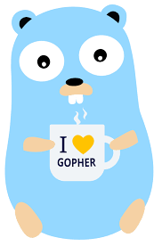

# leetcodego
Leetcode practice with Go. Solving challneges using Leetcode using Go.
Target is to solve 500 challenges in 2023 :)

## Installation
```
git clone https://github.com/AntonyIS/leetcodego.git
```
## Test all leetcode solutions
```
make test
```
## Run Leetcode Go script
```
make serve
```